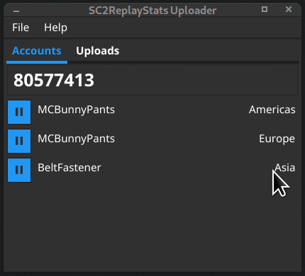
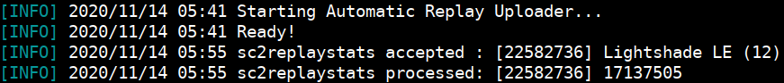

# Unofficial **SC2ReplayStats Uploader** by AlbinoGeek

[](https://github.com/AlbinoGeek/sc2-rsu/blob/master/LICENSE)
[](https://github.com/AlbinoGeek/sc2-rsu)
[](https://codeclimate.com/github/AlbinoGeek/sc2-rsu/maintainability)  
[](#)
[](https://goreportcard.com/report/github.com/AlbinoGeek/sc2-rsu)
[](https://coveralls.io/github/AlbinoGeek/sc2-rsu?branch=gui/v2)





## Features

- Cross-Platform: Full Linux and Windows support, Mac OS X untested
- Bronze Friendly: `login` command accepts an API Key or Email Address
- Optimized Build: Requires no vespene, and less than 10MB of RAM

Missing a feature? [Request it!](https://github.com/AlbinoGeek/sc2-rsu/issues/new?assignees=AlbinoGeek&labels=enhancement&template=feature-request.md&title=%5BFEATURE+REQUEST%5D)

## Usage

### Using the Graphical Interface

1. [Download a Release](https://github.com/AlbinoGeek/sc2-rsu/releases) or [Get the Sources](#building-from-source)
2. Run the program without a command to open the Graphical User Interface
3. Follow the on-screen First-Time Setup to get started!

### Using the Command-Line Interface

1. [Download a Release](https://github.com/AlbinoGeek/sc2-rsu/releases) or [Get the Sources](#building-from-source)
2. Issue the `login` command to perform one-time setup (get your SC2ReplayStats API Key)
3. Run the program with the `--text` switch to automatically upload games as they are played

```
$ sc2-rsu login john@doe.com
  Password for sc2ReplayStats account john@doe.com:
  Success! Logged in to account #9001
  API Key set in configuration!

$ sc2-rsu
  Starting Automatic Replay Uploader...
  Ready!
```


For full usage instructions, consult the `--help` output.

## Building From Source

1. Install Golang
2. Clone the repository
3. Run `make`

```bash
# Install Golang [apt / yum / dnf install golang]
$ git clone https://github.com/AlbinoGeek/sc2-rsu
$ cd sc2-rsu
$ make all
```

The binary will be built into the `_dist` directory.

## License

This project is licensed under the terms of the [MIT License](/LICENSE).
